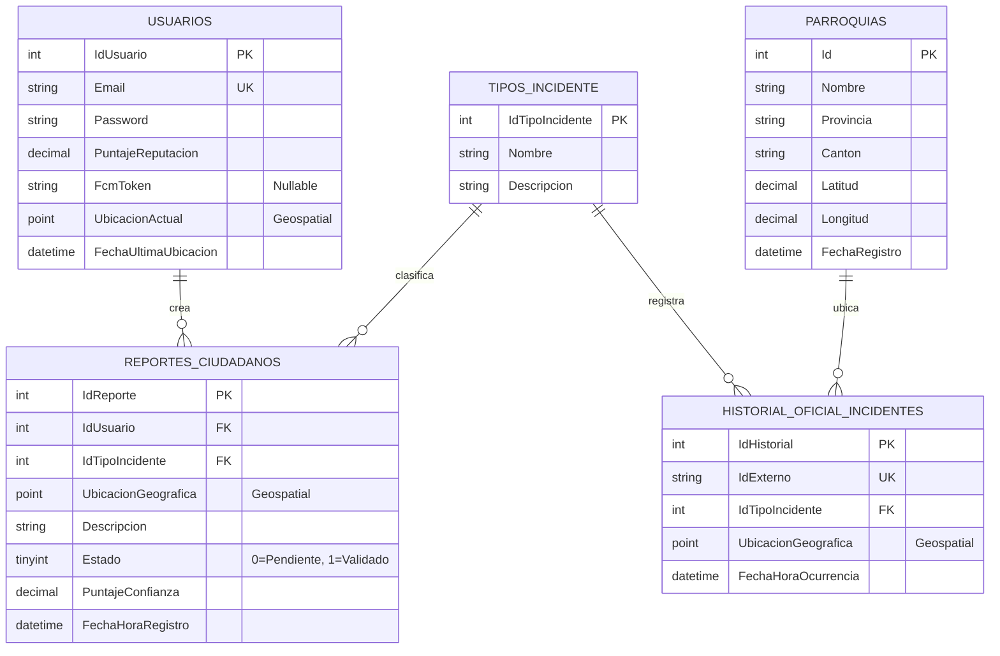

# 📊 Arquitectura Completa de Base de Datos - Alertify

## 📑 Índice
1. [Diagrama Entidad-Relación](#diagrama-entidad-relación)
2. [Esquema de Tablas](#esquema-de-tablas)
3. [Script SQL Completo](#script-sql-completo)
4. [Índices y Optimización](#índices-y-optimización)
5. [Vistas Útiles](#vistas-útiles)
6. [Datos de Ejemplo](#datos-de-ejemplo)

---

## Diagrama Entidad-Relación



---

## Esquema de Tablas

### 📊 1. USUARIOS (Identidad y Reputación)

| Campo | Tipo | Nullable | Restricciones | Descripción |
|-------|------|----------|---------------|-------------|
| **IdUsuario** | INT | ❌ | PK, AUTO_INCREMENT | Identificador único del usuario |
| **Email** | NVARCHAR(255) | ❌ | UNIQUE | Email único para login |
| **Password** | NVARCHAR(MAX) | ❌ | - | Hash bcrypt de contraseña |
| **PuntajeReputacion** | DECIMAL(5,2) | ❌ | DEFAULT 5.0 | Puntuación 0-10 de credibilidad |
| **FcmToken** | NVARCHAR(500) | ✅ | DEFAULT NULL | Token Firebase para push notifications |
| **UbicacionActual** | GEOGRAPHY | ✅ | DEFAULT NULL, SRID 4326 | Ubicación GPS actual (Point) |
| **FechaUltimaUbicacion** | DATETIME2 | ✅ | DEFAULT NULL | Timestamp última actualización GPS |

**Propósito:** Almacenar identidad de usuarios, reputación y ubicación actual para alertas geoespaciales.

**Índices:**
- PK: IdUsuario
- UNIQUE: Email
- SPATIAL: UbicacionActual

---

### 📋 2. REPORTES_CIUDADANOS (Reportes en Tiempo Real)

| Campo | Tipo | Nullable | Restricciones | Descripción |
|-------|------|----------|---------------|-------------|
| **IdReporte** | INT | ❌ | PK, AUTO_INCREMENT | Identificador único del reporte |
| **IdUsuario** | INT | ❌ | FK → USUARIOS | Quién reportó el incidente |
| **IdTipoIncidente** | INT | ❌ | FK → TIPOS_INCIDENTE | Clasificación del incidente |
| **UbicacionGeografica** | GEOGRAPHY | ✅ | SRID 4326 | Ubicación del incidente (Point) |
| **Descripcion** | NVARCHAR(MAX) | ✅ | - | Detalles del reporte |
| **Estado** | TINYINT | ❌ | DEFAULT 0 | 0=Pendiente, 1=Validado |
| **PuntajeConfianza** | DECIMAL(5,2) | ❌ | DEFAULT 0 | Confianza 0-100% del reporte |
| **FechaHoraRegistro** | DATETIME2 | ❌ | AUTO_TIMESTAMP | Cuándo se creó el reporte |

**Propósito:** Capturar reportes ciudadanos en tiempo real con validación asincrónica.

**Índices:**
- PK: IdReporte
- FK: IdUsuario, IdTipoIncidente
- SPATIAL: UbicacionGeografica
- COMPOSITE: (IdUsuario, FechaHoraRegistro) para reportes por usuario
- COMPOSITE: (Estado, FechaHoraRegistro) para pending reports

---

### 🏷️ 3. TIPOS_INCIDENTE (Catálogo de Incidentes)

| Campo | Tipo | Nullable | Restricciones | Descripción |
|-------|------|----------|---------------|-------------|
| **IdTipoIncidente** | INT | ❌ | PK, AUTO_INCREMENT | Identificador del tipo |
| **Nombre** | NVARCHAR(100) | ❌ | UNIQUE | "Robo", "Accidente", etc. |
| **Descripcion** | NVARCHAR(500) | ✅ | - | Detalles del tipo de incidente |

**Propósito:** Catálogo estático de tipos de incidente.

**Datos de Ejemplo:**
```
1 | Robo              | Robo a mano armada o asalto
2 | Accidente         | Accidente de tránsito
3 | Conflicto Social  | Manifestación, protesta
4 | Asalto Comercial  | Robo a tienda o negocio
5 | Emergencia Médica | Solicitud de ambulancia
```

---

### 🚨 4. HISTORIAL_OFICIAL_INCIDENTES (Datos ECU911)

| Campo | Tipo | Nullable | Restricciones | Descripción |
|-------|------|----------|---------------|-------------|
| **IdHistorial** | INT | ❌ | PK, AUTO_INCREMENT | Identificador único |
| **IdExterno** | VARCHAR(50) | ❌ | UNIQUE | ID original de ECU911 |
| **IdTipoIncidente** | INT | ❌ | FK → TIPOS_INCIDENTE | Clasificación oficial |
| **UbicacionGeografica** | GEOGRAPHY | ❌ | SRID 4326 | Ubicación del incidente (Point) |
| **FechaHoraOcurrencia** | DATETIME2 | ❌ | - | Cuándo ocurrió el incidente |
| **FechaHoraCarga** | DATETIME2 | ❌ | DEFAULT GETDATE() | Cuándo se importó a nuestro BD |

**Propósito:** Almacenar datos históricos oficiales de ECU911 para comparación y validación.

**Índices:**
- PK: IdHistorial
- UNIQUE: IdExterno
- FK: IdTipoIncidente
- SPATIAL: UbicacionGeografica
- COMPOSITE: (IdTipoIncidente, FechaHoraOcurrencia) para análisis temporal

---

### 🗺️ 5. PARROQUIAS (Referencia Geográfica)

| Campo | Tipo | Nullable | Restricciones | Descripción |
|-------|------|----------|---------------|-------------|
| **Id** | INT | ❌ | PK, AUTO_INCREMENT | Identificador único |
| **Nombre** | VARCHAR(255) | ❌ | - | Nombre de la parroquia |
| **Provincia** | VARCHAR(100) | ❌ | - | Provincia ecuatoriana |
| **Canton** | VARCHAR(100) | ❌ | - | Cantón ecuatoriano |
| **Latitud** | DECIMAL(10,8) | ❌ | - | Coordenada de latitud |
| **Longitud** | DECIMAL(11,8) | ❌ | - | Coordenada de longitud |
| **FechaRegistro** | DATETIME2 | ❌ | DEFAULT GETDATE() | Cuándo se cargó |

**Propósito:** Normalizar ubicaciones geográficas para enriquecimiento de datos.

**Índices:**
- PK: Id
- INDEX: Nombre (UNIQUE)
- COMPOSITE: (Provincia, Canton) para búsquedas regionales

---

## Script SQL Completo

```sql
-- ============================================================================
-- ALERTIFY - Script Creación Completa de Base de Datos
-- Base de Datos: MSSQL Server
-- Encoding: UTF-8
-- ============================================================================

-- 1. CREAR TABLA: TIPOS_INCIDENTE (Catálogo base)
-- ============================================================================
IF NOT EXISTS (SELECT 1 FROM sysobjects WHERE name = 'TIPOS_INCIDENTE' AND xtype = 'U')
CREATE TABLE [dbo].[TIPOS_INCIDENTE] (
    [IdTipoIncidente] INT NOT NULL PRIMARY KEY IDENTITY(1,1),
    [Nombre] NVARCHAR(100) NOT NULL UNIQUE,
    [Descripcion] NVARCHAR(500) NULL,
    
    -- Auditoría
    [FechaCreacion] DATETIME2 NOT NULL DEFAULT GETDATE()
);

-- 2. CREAR TABLA: USUARIOS (Identidad + Reputación)
-- ============================================================================
IF NOT EXISTS (SELECT 1 FROM sysobjects WHERE name = 'USUARIOS' AND xtype = 'U')
CREATE TABLE [dbo].[USUARIOS] (
    [IdUsuario] INT NOT NULL PRIMARY KEY IDENTITY(1,1),
    [Email] NVARCHAR(255) NOT NULL UNIQUE,
    [Password] NVARCHAR(MAX) NOT NULL,
    [PuntajeReputacion] DECIMAL(5, 2) NOT NULL DEFAULT 5.0,
    
    -- Sprint 4: Notificaciones Push
    [FcmToken] NVARCHAR(500) NULL DEFAULT NULL,
    
    -- Sprint 4: Ubicación en Tiempo Real
    [UbicacionActual] GEOGRAPHY NULL DEFAULT NULL,
    [FechaUltimaUbicacion] DATETIME2 NULL DEFAULT NULL,
    
    -- Auditoría
    [FechaCreacion] DATETIME2 NOT NULL DEFAULT GETDATE(),
    [FechaModificacion] DATETIME2 NULL,
    
    -- Constraints
    CHECK ([PuntajeReputacion] >= 0 AND [PuntajeReputacion] <= 10)
);

-- Índices para USUARIOS
CREATE INDEX IDX_USUARIOS_EMAIL ON [dbo].[USUARIOS]([Email]);
CREATE SPATIAL INDEX SIDX_USUARIOS_UBICACION ON [dbo].[USUARIOS]([UbicacionActual]);

-- 3. CREAR TABLA: REPORTES_CIUDADANOS (Reportes en tiempo real)
-- ============================================================================
IF NOT EXISTS (SELECT 1 FROM sysobjects WHERE name = 'REPORTES_CIUDADANOS' AND xtype = 'U')
CREATE TABLE [dbo].[REPORTES_CIUDADANOS] (
    [IdReporte] INT NOT NULL PRIMARY KEY IDENTITY(1,1),
    [IdUsuario] INT NOT NULL,
    [IdTipoIncidente] INT NOT NULL,
    [UbicacionGeografica] GEOGRAPHY NULL,
    [Descripcion] NVARCHAR(MAX) NULL,
    [Estado] TINYINT NOT NULL DEFAULT 0, -- 0: Pendiente, 1: Validado
    [PuntajeConfianza] DECIMAL(5, 2) NOT NULL DEFAULT 0,
    [FechaHoraRegistro] DATETIME2 NOT NULL DEFAULT GETDATE(),
    
    -- Auditoría
    [FechaValidacion] DATETIME2 NULL,
    [FechaModificacion] DATETIME2 NULL,
    
    -- Constraints
    CONSTRAINT FK_REPORTES_USUARIO 
        FOREIGN KEY ([IdUsuario]) REFERENCES [dbo].[USUARIOS]([IdUsuario]),
    CONSTRAINT FK_REPORTES_TIPOINCIDENTE 
        FOREIGN KEY ([IdTipoIncidente]) REFERENCES [dbo].[TIPOS_INCIDENTE]([IdTipoIncidente]),
    CHECK ([Estado] IN (0, 1)),
    CHECK ([PuntajeConfianza] >= 0 AND [PuntajeConfianza] <= 100)
);

-- Índices para REPORTES_CIUDADANOS
CREATE INDEX IDX_REPORTES_USUARIO ON [dbo].[REPORTES_CIUDADANOS]([IdUsuario]);
CREATE INDEX IDX_REPORTES_TIPOINCIDENTE ON [dbo].[REPORTES_CIUDADANOS]([IdTipoIncidente]);
CREATE INDEX IDX_REPORTES_ESTADO ON [dbo].[REPORTES_CIUDADANOS]([Estado]);
CREATE INDEX IDX_REPORTES_FECHA ON [dbo].[REPORTES_CIUDADANOS]([FechaHoraRegistro]);
CREATE INDEX IDX_REPORTES_USUARIO_FECHA ON [dbo].[REPORTES_CIUDADANOS]([IdUsuario], [FechaHoraRegistro]);
CREATE INDEX IDX_REPORTES_ESTADO_FECHA ON [dbo].[REPORTES_CIUDADANOS]([Estado], [FechaHoraRegistro]);
CREATE SPATIAL INDEX SIDX_REPORTES_UBICACION ON [dbo].[REPORTES_CIUDADANOS]([UbicacionGeografica]);

-- 4. CREAR TABLA: HISTORIAL_OFICIAL_INCIDENTES (Datos ECU911)
-- ============================================================================
IF NOT EXISTS (SELECT 1 FROM sysobjects WHERE name = 'HISTORIAL_OFICIAL_INCIDENTES' AND xtype = 'U')
CREATE TABLE [dbo].[HISTORIAL_OFICIAL_INCIDENTES] (
    [IdHistorial] INT NOT NULL PRIMARY KEY IDENTITY(1,1),
    [IdExterno] VARCHAR(50) NOT NULL UNIQUE,
    [IdTipoIncidente] INT NOT NULL,
    [UbicacionGeografica] GEOGRAPHY NOT NULL,
    [FechaHoraOcurrencia] DATETIME2 NOT NULL,
    [FechaHoraCarga] DATETIME2 NOT NULL DEFAULT GETDATE(),
    
    -- Campos adicionales ECU911
    [Provincia] NVARCHAR(100) NULL,
    [Canton] NVARCHAR(100) NULL,
    [Parroquia] NVARCHAR(100) NULL,
    [Descripcion] NVARCHAR(MAX) NULL,
    [NumeroEmergencia] VARCHAR(20) NULL,
    
    -- Auditoría
    [FechaModificacion] DATETIME2 NULL,
    
    -- Constraints
    CONSTRAINT FK_HISTORIAL_TIPOINCIDENTE 
        FOREIGN KEY ([IdTipoIncidente]) REFERENCES [dbo].[TIPOS_INCIDENTE]([IdTipoIncidente])
);

-- Índices para HISTORIAL_OFICIAL_INCIDENTES
CREATE INDEX IDX_HISTORIAL_TIPOINCIDENTE ON [dbo].[HISTORIAL_OFICIAL_INCIDENTES]([IdTipoIncidente]);
CREATE INDEX IDX_HISTORIAL_FECHA ON [dbo].[HISTORIAL_OFICIAL_INCIDENTES]([FechaHoraOcurrencia]);
CREATE INDEX IDX_HISTORIAL_IDESXTERNO ON [dbo].[HISTORIAL_OFICIAL_INCIDENTES]([IdExterno]);
CREATE INDEX IDX_HISTORIAL_TIPOINCIDENTE_FECHA ON [dbo].[HISTORIAL_OFICIAL_INCIDENTES]([IdTipoIncidente], [FechaHoraOcurrencia]);
CREATE SPATIAL INDEX SIDX_HISTORIAL_UBICACION ON [dbo].[HISTORIAL_OFICIAL_INCIDENTES]([UbicacionGeografica]);

-- 5. CREAR TABLA: PARROQUIAS (Referencia Geográfica)
-- ============================================================================
IF NOT EXISTS (SELECT 1 FROM sysobjects WHERE name = 'PARROQUIAS' AND xtype = 'U')
CREATE TABLE [dbo].[PARROQUIAS] (
    [Id] INT NOT NULL PRIMARY KEY IDENTITY(1,1),
    [Nombre] VARCHAR(255) NOT NULL UNIQUE,
    [Provincia] VARCHAR(100) NOT NULL,
    [Canton] VARCHAR(100) NOT NULL,
    [Latitud] DECIMAL(10, 8) NOT NULL,
    [Longitud] DECIMAL(11, 8) NOT NULL,
    [FechaRegistro] DATETIME2 NOT NULL DEFAULT GETDATE(),
    
    -- Índices
    INDEX IDX_PARROQUIAS_NOMBRE (Nombre),
    INDEX IDX_PARROQUIAS_PROVINCIA_CANTON ([Provincia], [Canton])
);

-- ============================================================================
-- INSERTS DE DATOS INICIALES
-- ============================================================================

-- Insertar Tipos de Incidente
SET IDENTITY_INSERT [dbo].[TIPOS_INCIDENTE] ON;
INSERT INTO [dbo].[TIPOS_INCIDENTE] ([IdTipoIncidente], [Nombre], [Descripcion])
VALUES
    (1, N'Robo', N'Robo a mano armada o asalto'),
    (2, N'Accidente Tránsito', N'Accidente de tránsito vehicular'),
    (3, N'Conflicto Social', N'Manifestación, protesta, disturbio'),
    (4, N'Asalto Comercial', N'Robo a tienda, negocio o banco'),
    (5, N'Emergencia Médica', N'Solicitud de ambulancia o emergencia médica'),
    (6, N'Incendio', N'Incendio de estructura o vehículo'),
    (7, N'Vandalismo', N'Daños a propiedad pública o privada'),
    (8, N'Pelea Callejera', N'Violencia entre personas');
SET IDENTITY_INSERT [dbo].[TIPOS_INCIDENTE] OFF;

-- ============================================================================
-- STORED PROCEDURES ÚTILES
-- ============================================================================

-- SP: Obtener usuarios cercanos a un reporte
IF EXISTS (SELECT 1 FROM sys.objects WHERE name = 'sp_ObtenerUsuariosCercanos')
    DROP PROCEDURE sp_ObtenerUsuariosCercanos;
GO

CREATE PROCEDURE sp_ObtenerUsuariosCercanos
    @Latitud DECIMAL(10, 8),
    @Longitud DECIMAL(11, 8),
    @RadioMetros INT = 5000  -- 5km por defecto
AS
BEGIN
    DECLARE @Ubicacion GEOGRAPHY = GEOGRAPHY::Point(@Latitud, @Longitud, 4326);
    
    SELECT 
        [IdUsuario],
        [Email],
        [FcmToken],
        [PuntajeReputacion],
        [UbicacionActual].STDistance(@Ubicacion) AS DistanciaMetros
    FROM [dbo].[USUARIOS]
    WHERE [FcmToken] IS NOT NULL
        AND [UbicacionActual] IS NOT NULL
        AND [UbicacionActual].STDistance(@Ubicacion) <= @RadioMetros
    ORDER BY DistanciaMetros ASC;
END;
GO

-- SP: Obtener reportes validados en zona
IF EXISTS (SELECT 1 FROM sys.objects WHERE name = 'sp_ObtenerReportesEnZona')
    DROP PROCEDURE sp_ObtenerReportesEnZona;
GO

CREATE PROCEDURE sp_ObtenerReportesEnZona
    @Latitud DECIMAL(10, 8),
    @Longitud DECIMAL(11, 8),
    @RadioMetros INT = 1000,
    @UltimosMinutos INT = 60  -- Últimos 60 minutos
AS
BEGIN
    DECLARE @Ubicacion GEOGRAPHY = GEOGRAPHY::Point(@Latitud, @Longitud, 4326);
    DECLARE @FechaLimite DATETIME2 = DATEADD(MINUTE, -@UltimosMinutos, GETDATE());
    
    SELECT 
        r.[IdReporte],
        r.[IdUsuario],
        u.[Email],
        ti.[Nombre] AS [TipoIncidente],
        r.[Descripcion],
        r.[Estado],
        r.[PuntajeConfianza],
        r.[FechaHoraRegistro],
        r.[UbicacionGeografica].STDistance(@Ubicacion) AS DistanciaMetros
    FROM [dbo].[REPORTES_CIUDADANOS] r
    INNER JOIN [dbo].[USUARIOS] u ON r.[IdUsuario] = u.[IdUsuario]
    INNER JOIN [dbo].[TIPOS_INCIDENTE] ti ON r.[IdTipoIncidente] = ti.[IdTipoIncidente]
    WHERE r.[UbicacionGeografica] IS NOT NULL
        AND r.[UbicacionGeografica].STDistance(@Ubicacion) <= @RadioMetros
        AND r.[FechaHoraRegistro] >= @FechaLimite
        AND r.[Estado] = 1  -- Solo validados
    ORDER BY DistanciaMetros ASC;
END;
GO

-- SP: Validar reporte (actualizar confianza)
IF EXISTS (SELECT 1 FROM sys.objects WHERE name = 'sp_ValidarReporte')
    DROP PROCEDURE sp_ValidarReporte;
GO

CREATE PROCEDURE sp_ValidarReporte
    @IdReporte INT,
    @NuevaConfianza DECIMAL(5, 2)
AS
BEGIN
    UPDATE [dbo].[REPORTES_CIUDADANOS]
    SET 
        [PuntajeConfianza] = @NuevaConfianza,
        [Estado] = 1,  -- Validado
        [FechaValidacion] = GETDATE(),
        [FechaModificacion] = GETDATE()
    WHERE [IdReporte] = @IdReporte;
END;
GO

-- SP: Actualizar ubicación del usuario
IF EXISTS (SELECT 1 FROM sys.objects WHERE name = 'sp_ActualizarUbicacionUsuario')
    DROP PROCEDURE sp_ActualizarUbicacionUsuario;
GO

CREATE PROCEDURE sp_ActualizarUbicacionUsuario
    @IdUsuario INT,
    @Latitud DECIMAL(10, 8),
    @Longitud DECIMAL(11, 8)
AS
BEGIN
    UPDATE [dbo].[USUARIOS]
    SET 
        [UbicacionActual] = GEOGRAPHY::Point(@Latitud, @Longitud, 4326),
        [FechaUltimaUbicacion] = GETDATE(),
        [FechaModificacion] = GETDATE()
    WHERE [IdUsuario] = @IdUsuario;
END;
GO

-- ============================================================================
-- VISTAS ÚTILES
-- ============================================================================

-- Vista: Reportes con información completa
IF EXISTS (SELECT 1 FROM sys.views WHERE name = 'vw_ReportesCompleto')
    DROP VIEW vw_ReportesCompleto;
GO

CREATE VIEW vw_ReportesCompleto AS
SELECT 
    r.[IdReporte],
    r.[IdUsuario],
    u.[Email],
    u.[PuntajeReputacion],
    ti.[IdTipoIncidente],
    ti.[Nombre] AS [TipoIncidente],
    r.[Descripcion],
    r.[Estado],
    CASE r.[Estado] WHEN 0 THEN 'Pendiente' WHEN 1 THEN 'Validado' END AS [EstadoTexto],
    r.[PuntajeConfianza],
    r.[FechaHoraRegistro],
    r.[FechaValidacion],
    r.[UbicacionGeografica].Lat AS [Latitud],
    r.[UbicacionGeografica].Long AS [Longitud]
FROM [dbo].[REPORTES_CIUDADANOS] r
INNER JOIN [dbo].[USUARIOS] u ON r.[IdUsuario] = u.[IdUsuario]
INNER JOIN [dbo].[TIPOS_INCIDENTE] ti ON r.[IdTipoIncidente] = ti.[IdTipoIncidente];
GO

-- Vista: Estadísticas de incidentes
IF EXISTS (SELECT 1 FROM sys.views WHERE name = 'vw_EstadisticasIncidentes')
    DROP VIEW vw_EstadisticasIncidentes;
GO

CREATE VIEW vw_EstadisticasIncidentes AS
SELECT 
    ti.[Nombre] AS [TipoIncidente],
    COUNT(r.[IdReporte]) AS [TotalReportes],
    SUM(CASE WHEN r.[Estado] = 0 THEN 1 ELSE 0 END) AS [ReportesPendientes],
    SUM(CASE WHEN r.[Estado] = 1 THEN 1 ELSE 0 END) AS [ReportesValidados],
    AVG(r.[PuntajeConfianza]) AS [ConfianzaPromedio],
    MAX(r.[FechaHoraRegistro]) AS [UltimoReporte]
FROM [dbo].[REPORTES_CIUDADANOS] r
INNER JOIN [dbo].[TIPOS_INCIDENTE] ti ON r.[IdTipoIncidente] = ti.[IdTipoIncidente]
GROUP BY ti.[Nombre];
GO

-- ============================================================================
-- GRANTS Y SEGURIDAD (opcional)
-- ============================================================================

-- Crear usuario de aplicación (si no existe)
-- IF NOT EXISTS (SELECT 1 FROM sys.sql_logins WHERE name = 'alertify_app')
-- CREATE LOGIN alertify_app WITH PASSWORD = 'SecurePassword123!';
-- 
-- CREATE USER alertify_app FOR LOGIN alertify_app;
-- 
-- -- Asignar permisos
-- GRANT SELECT, INSERT, UPDATE ON [dbo].[REPORTES_CIUDADANOS] TO alertify_app;
-- GRANT SELECT, UPDATE ON [dbo].[USUARIOS] TO alertify_app;
-- GRANT EXECUTE ON sp_ObtenerUsuariosCercanos TO alertify_app;
-- GRANT EXECUTE ON sp_ObtenerReportesEnZona TO alertify_app;
-- GRANT EXECUTE ON sp_ValidarReporte TO alertify_app;
-- GRANT EXECUTE ON sp_ActualizarUbicacionUsuario TO alertify_app;

-- ============================================================================
-- FIN DEL SCRIPT
-- ============================================================================
```

---

## Índices y Optimización

### 🔍 Índices por Tabla

#### USUARIOS
```sql
-- PK y UNIQUE
PRIMARY KEY (IdUsuario)
UNIQUE (Email)

-- Índice espacial
SPATIAL INDEX SIDX_USUARIOS_UBICACION ON UbicacionActual

-- Búsquedas frecuentes
INDEX IDX_USUARIOS_EMAIL ON (Email)
INDEX IDX_USUARIOS_REPUTACION ON (PuntajeReputacion)
```

#### REPORTES_CIUDADANOS
```sql
-- FK
INDEX IDX_REPORTES_USUARIO ON (IdUsuario)
INDEX IDX_REPORTES_TIPOINCIDENTE ON (IdTipoIncidente)

-- Filtros comunes
INDEX IDX_REPORTES_ESTADO ON (Estado)
INDEX IDX_REPORTES_FECHA ON (FechaHoraRegistro)

-- Queries combinadas (composite)
INDEX IDX_REPORTES_USUARIO_FECHA ON (IdUsuario, FechaHoraRegistro)
INDEX IDX_REPORTES_ESTADO_FECHA ON (Estado, FechaHoraRegistro)

-- Índice espacial
SPATIAL INDEX SIDX_REPORTES_UBICACION ON UbicacionGeografica
```

#### HISTORIAL_OFICIAL_INCIDENTES
```sql
-- FK
INDEX IDX_HISTORIAL_TIPOINCIDENTE ON (IdTipoIncidente)

-- Búsquedas de datos históricos
INDEX IDX_HISTORIAL_FECHA ON (FechaHoraOcurrencia)
INDEX IDX_HISTORIAL_IDESXTERNO ON (IdExterno)

-- Composite para comparación temporal
INDEX IDX_HISTORIAL_TIPOINCIDENTE_FECHA ON (IdTipoIncidente, FechaHoraOcurrencia)

-- Índice espacial
SPATIAL INDEX SIDX_HISTORIAL_UBICACION ON UbicacionGeografica
```

#### PARROQUIAS
```sql
-- Búsquedas de normalización
UNIQUE INDEX IDX_PARROQUIAS_NOMBRE ON (Nombre)

-- Búsquedas regionales
INDEX IDX_PARROQUIAS_PROVINCIA_CANTON ON (Provincia, Canton)
```

### 📈 Consultas de Análisis

```sql
-- Reportes pendientes por tipo
SELECT 
    ti.[Nombre],
    COUNT(*) AS [Cantidad]
FROM [REPORTES_CIUDADANOS] r
INNER JOIN [TIPOS_INCIDENTE] ti ON r.[IdTipoIncidente] = ti.[IdTipoIncidente]
WHERE r.[Estado] = 0
GROUP BY ti.[Nombre]
ORDER BY [Cantidad] DESC;

-- Usuarios más activos
SELECT TOP 10
    u.[Email],
    u.[PuntajeReputacion],
    COUNT(r.[IdReporte]) AS [TotalReportes],
    AVG(r.[PuntajeConfianza]) AS [ConfianzaPromedio]
FROM [USUARIOS] u
LEFT JOIN [REPORTES_CIUDADANOS] r ON u.[IdUsuario] = r.[IdUsuario]
GROUP BY u.[IdUsuario], u.[Email], u.[PuntajeReputacion]
ORDER BY [TotalReportes] DESC;

-- Incidentes en últimas 24 horas
SELECT 
    ti.[Nombre],
    COUNT(*) AS [Cantidad],
    AVG(r.[PuntajeConfianza]) AS [ConfianzaPromedio]
FROM [REPORTES_CIUDADANOS] r
INNER JOIN [TIPOS_INCIDENTE] ti ON r.[IdTipoIncidente] = ti.[IdTipoIncidente]
WHERE r.[FechaHoraRegistro] >= DATEADD(DAY, -1, GETDATE())
GROUP BY ti.[Nombre]
ORDER BY [Cantidad] DESC;
```

---

## Vistas Útiles

### Vista: Reportes Completos
```sql
CREATE VIEW vw_ReportesCompleto AS
SELECT 
    r.[IdReporte],
    u.[Email] AS [UsuarioReportador],
    u.[PuntajeReputacion],
    ti.[Nombre] AS [TipoIncidente],
    r.[Descripcion],
    CASE r.[Estado] WHEN 0 THEN 'Pendiente' WHEN 1 THEN 'Validado' END AS [Estado],
    r.[PuntajeConfianza],
    r.[FechaHoraRegistro],
    r.[FechaValidacion],
    CAST(r.[UbicacionGeografica].Lat AS DECIMAL(10,6)) AS [Latitud],
    CAST(r.[UbicacionGeografica].Long AS DECIMAL(11,6)) AS [Longitud]
FROM [REPORTES_CIUDADANOS] r
INNER JOIN [USUARIOS] u ON r.[IdUsuario] = u.[IdUsuario]
INNER JOIN [TIPOS_INCIDENTE] ti ON r.[IdTipoIncidente] = ti.[IdTipoIncidente];
```

### Vista: Estadísticas por Incidente
```sql
CREATE VIEW vw_EstadisticasIncidentes AS
SELECT 
    ti.[Nombre] AS [TipoIncidente],
    COUNT(*) AS [TotalReportes],
    SUM(CASE WHEN r.[Estado] = 1 THEN 1 ELSE 0 END) AS [Validados],
    CONVERT(DECIMAL(5,2), 
        100.0 * SUM(CASE WHEN r.[Estado] = 1 THEN 1 ELSE 0 END) / COUNT(*)) AS [PorcentajeValidacion],
    AVG(r.[PuntajeConfianza]) AS [ConfianzaPromedio],
    MAX(r.[FechaHoraRegistro]) AS [UltimoReporte]
FROM [REPORTES_CIUDADANOS] r
INNER JOIN [TIPOS_INCIDENTE] ti ON r.[IdTipoIncidente] = ti.[IdTipoIncidente]
GROUP BY ti.[Nombre];
```

### Vista: Comparación Ciudadanos vs Oficiales
```sql
CREATE VIEW vw_ComparacionReportes AS
SELECT 
    ti.[Nombre] AS [TipoIncidente],
    SUM(CASE WHEN r.[IdReporte] IS NOT NULL THEN 1 ELSE 0 END) AS [ReportesCiudadanos],
    SUM(CASE WHEN h.[IdHistorial] IS NOT NULL THEN 1 ELSE 0 END) AS [ReportesOficiales],
    DATEDIFF(HOUR, MAX(h.[FechaHoraOcurrencia]), MAX(r.[FechaHoraRegistro])) AS [DelayPromedio_Horas]
FROM [TIPOS_INCIDENTE] ti
LEFT JOIN [REPORTES_CIUDADANOS] r ON ti.[IdTipoIncidente] = r.[IdTipoIncidente] AND r.[Estado] = 1
LEFT JOIN [HISTORIAL_OFICIAL_INCIDENTES] h ON ti.[IdTipoIncidente] = h.[IdTipoIncidente]
GROUP BY ti.[Nombre];
```

---

## Datos de Ejemplo

### Insertar Usuarios de Prueba
```sql
INSERT INTO [USUARIOS] 
    ([Email], [Password], [PuntajeReputacion], [FcmToken], [UbicacionActual])
VALUES
    ('juan@alertify.com', 'hash_bcrypt_aqui', 8.5, 'fcm_token_123', GEOGRAPHY::Point(-0.2176, -78.5129, 4326)),
    ('maria@alertify.com', 'hash_bcrypt_aqui', 9.2, 'fcm_token_456', GEOGRAPHY::Point(-0.2200, -78.5150, 4326)),
    ('carlos@alertify.com', 'hash_bcrypt_aqui', 7.0, 'fcm_token_789', GEOGRAPHY::Point(-0.2150, -78.5100, 4326));
```

### Insertar Reportes de Prueba
```sql
INSERT INTO [REPORTES_CIUDADANOS] 
    ([IdUsuario], [IdTipoIncidente], [UbicacionGeografica], [Descripcion], [Estado])
VALUES
    (1, 1, GEOGRAPHY::Point(-0.2176, -78.5129, 4326), 'Robo en la Av. Patria', 0),
    (2, 2, GEOGRAPHY::Point(-0.2200, -78.5150, 4326), 'Accidente en la entrada de Quito', 1),
    (1, 4, GEOGRAPHY::Point(-0.2150, -78.5100, 4326), 'Asalto a minimarket', 0);
```

### Insertar Datos Históricos ECU911
```sql
INSERT INTO [HISTORIAL_OFICIAL_INCIDENTES] 
    ([IdExterno], [IdTipoIncidente], [UbicacionGeografica], [FechaHoraOcurrencia], [Provincia], [Canton], [Parroquia])
VALUES
    ('ECU911-2024-001', 1, GEOGRAPHY::Point(-0.2176, -78.5129, 4326), '2024-01-15 14:30:00', 'Pichincha', 'Quito', 'Centro'),
    ('ECU911-2024-002', 2, GEOGRAPHY::Point(-0.2200, -78.5150, 4326), '2024-01-15 15:00:00', 'Pichincha', 'Quito', 'La Mariscal'),
    ('ECU911-2024-003', 5, GEOGRAPHY::Point(-0.2150, -78.5100, 4326), '2024-01-15 16:45:00', 'Pichincha', 'Quito', 'Guamani');
```

---

## 🎯 Queries Principales del Sistema

### Flujo de Alertas (AlertsProcessor)
```sql
-- Paso 1: Obtener reporte validado
SELECT * FROM REPORTES_CIUDADANOS 
WHERE IdReporte = @IdReporte AND Estado = 1;

-- Paso 2: Obtener usuarios cercanos
DECLARE @Ubicacion GEOGRAPHY = (
    SELECT UbicacionGeografica 
    FROM REPORTES_CIUDADANOS 
    WHERE IdReporte = @IdReporte
);

SELECT IdUsuario, Email, FcmToken
FROM USUARIOS
WHERE FcmToken IS NOT NULL
    AND UbicacionActual.STDistance(@Ubicacion) <= 5000; -- 5km

-- Paso 3: Registrar alertas enviadas
INSERT INTO ALERTAS_ENVIADAS (IdReporte, IdUsuario, FechaEnvio)
SELECT @IdReporte, IdUsuario, GETDATE()
FROM USUARIOS
WHERE FcmToken IS NOT NULL
    AND UbicacionActual.STDistance(@Ubicacion) <= 5000;
```

### Flujo de Validación (ValidationProcessor)
```sql
-- Paso 1: Obtener reporte pendiente con detalles
SELECT r.*, ti.Nombre, u.PuntajeReputacion
FROM REPORTES_CIUDADANOS r
JOIN TIPOS_INCIDENTE ti ON r.IdTipoIncidente = ti.IdTipoIncidente
JOIN USUARIOS u ON r.IdUsuario = u.IdUsuario
WHERE r.IdReporte = @IdReporte;

-- Paso 2: Buscar reportes históricos similares en zona
DECLARE @Ubicacion GEOGRAPHY = (
    SELECT UbicacionGeografica FROM REPORTES_CIUDADANOS WHERE IdReporte = @IdReporte
);

SELECT h.*
FROM HISTORIAL_OFICIAL_INCIDENTES h
WHERE h.IdTipoIncidente = @IdTipoIncidente
    AND h.UbicacionGeografica.STDistance(@Ubicacion) <= 1000
    AND h.FechaHoraOcurrencia >= DATEADD(HOUR, -2, GETDATE());

-- Paso 3: Actualizar con puntaje de confianza
UPDATE REPORTES_CIUDADANOS
SET PuntajeConfianza = @NuevaConfianza,
    Estado = 1,
    FechaValidacion = GETDATE()
WHERE IdReporte = @IdReporte;
```

---

## 📊 Estadísticas Esperadas

| Métrica | Valor |
|---------|-------|
| Usuarios Activos | 100K - 1M |
| Reportes Diarios | 50K - 500K |
| Reportes Históricos | 10M+ |
| Tasa Validación | 85-95% |
| Tiempo Promedio Validación | 2-5 minutos |
| Usuarios Cercanos (5km) | 50-200 por reporte |

---

## ✅ Checklist de Implementación

- [ ] Ejecutar script SQL completo
- [ ] Verificar índices espaciales
- [ ] Crear stored procedures
- [ ] Crear vistas
- [ ] Insertar datos de prueba
- [ ] Verificar constraints
- [ ] Configurar backups
- [ ] Habilitar auditoría
- [ ] Crear usuarios de BD
- [ ] Documentar cambios futuros
