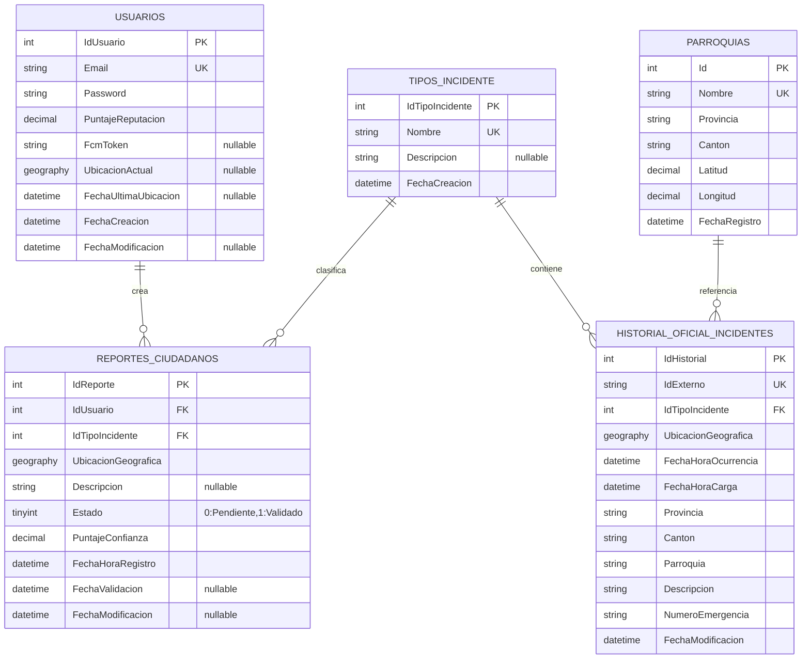
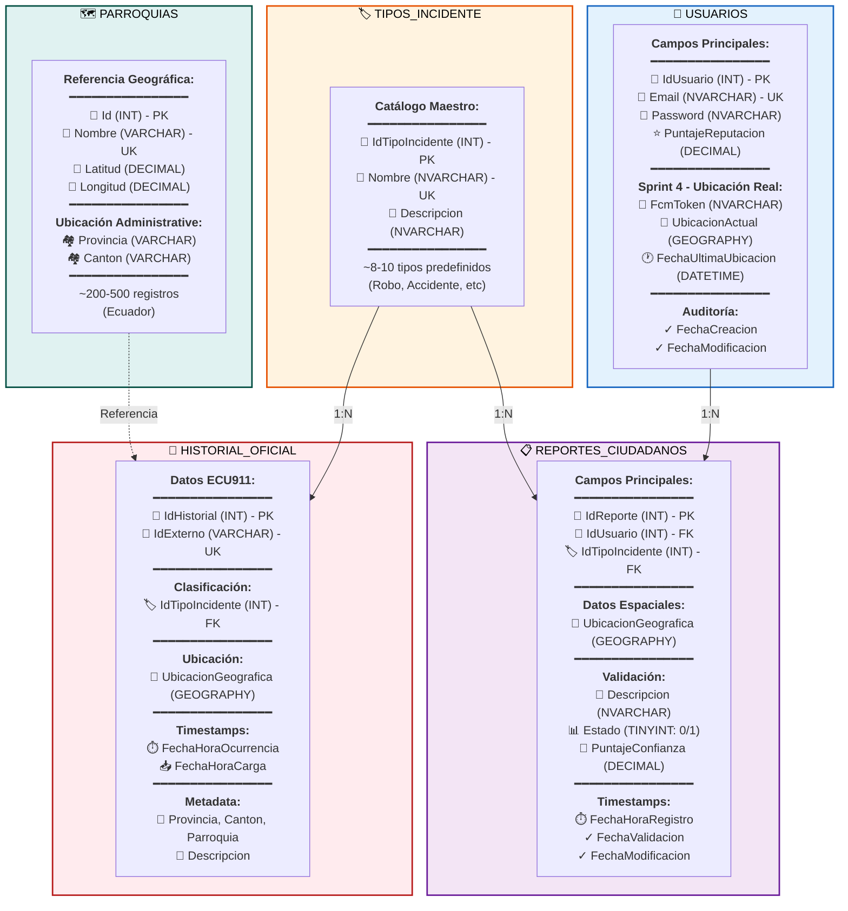
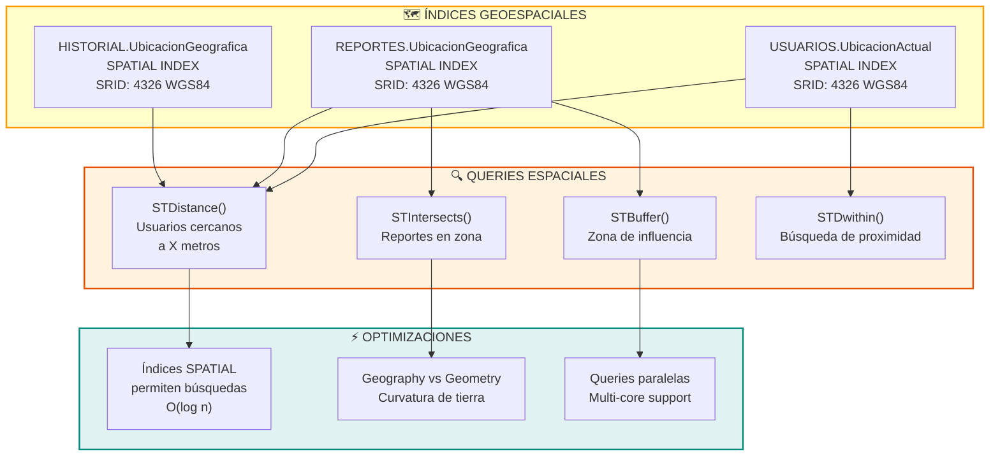
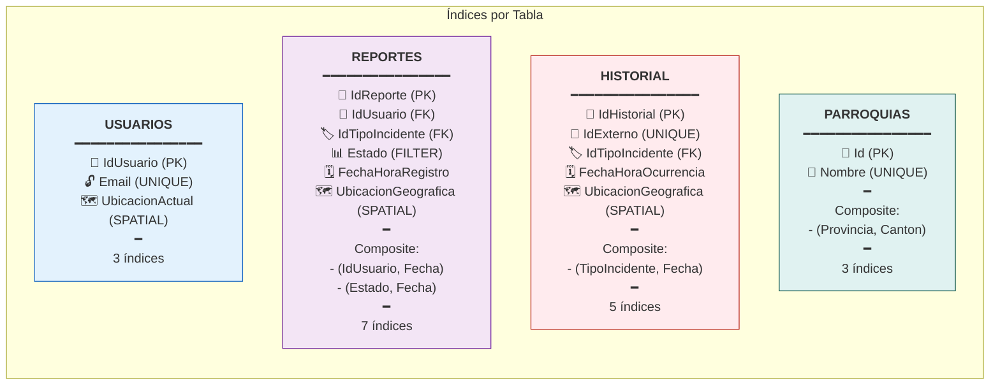
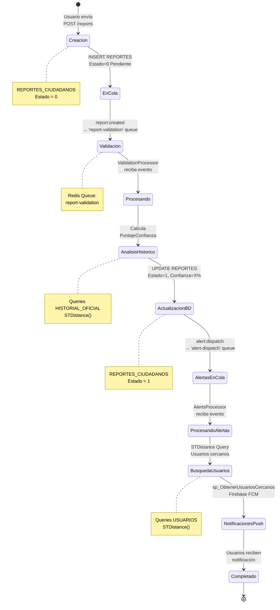
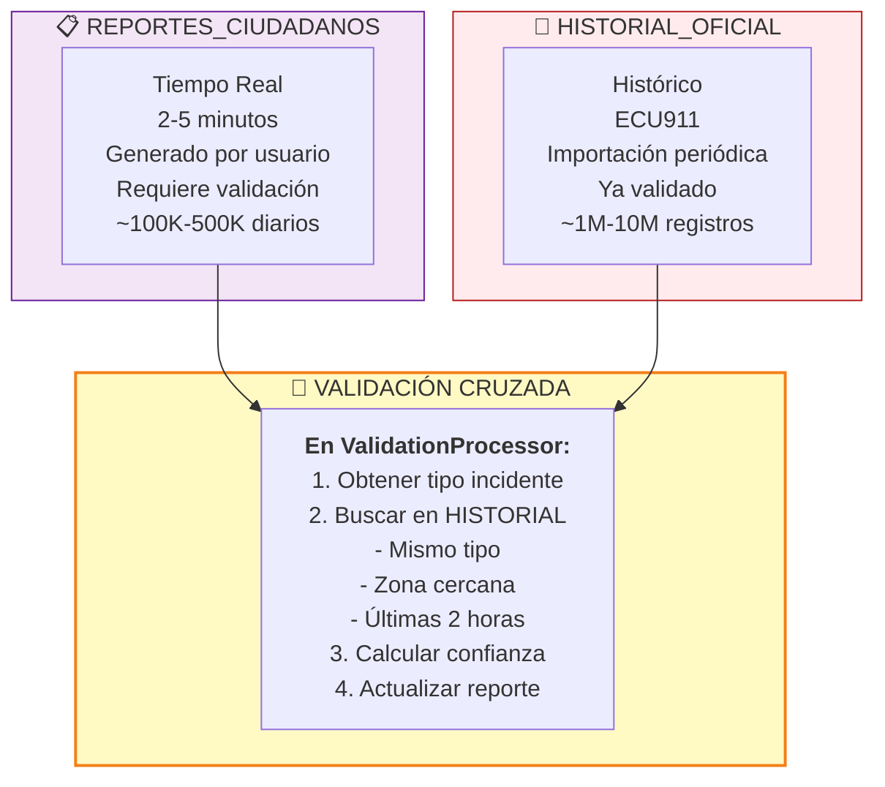
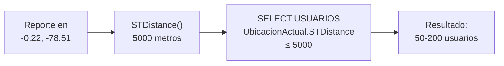
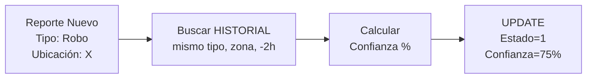
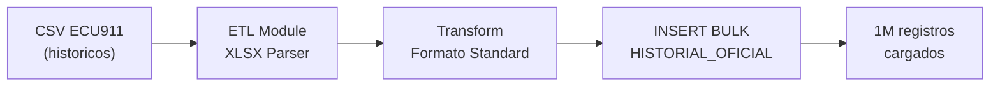

# 📊 Diagramas de Base de Datos - Alertify

## Diagrama Entidad-Relación (ER)



---

## Arquitectura de Tablas con Detalles Completos



---

## Flujo de Datos en la Base de Datos

```mermaid
graph LR
    A["📱 App Móvil<br/>Usuario Activa GPS"]
    
    B["🔵 API: PATCH /users/:id/location<br/>lat, lon"]
    
    C["✅ Actualiza<br/>USUARIOS.UbicacionActual"]
    
    D["📱 Usuario Crea Reporte<br/>POST /reports<br/>lat, lon, tipo, desc"]
    
    E["✅ Inserta<br/>REPORTES_CIUDADANOS<br/>Estado=0 Pendiente"]
    
    F["⚙️ Evento: report:created<br/>→ Cola 'report-validation'"]
    
    G["🟠 ValidationProcessor<br/>- Algoritmo Confianza<br/>- Analiza datos históricos<br/>- STDistance queries"]
    
    H["🔍 Busca en<br/>HISTORIAL_OFICIAL_INCIDENTES<br/>Tipo similar, zona, tiempo"]
    
    I["✅ Actualiza<br/>REPORTES_CIUDADANOS<br/>Estado=1, Confianza=X%"]
    
    J["⚙️ Evento: alert:dispatch<br/>→ Cola 'alert-dispatch'"]
    
    K["🟠 AlertsProcessor<br/>- sp_ObtenerUsuariosCercanos<br/>- STDistance a usuarios"]
    
    L["🔍 Busca en USUARIOS<br/>UbicacionActual STDistance"]
    
    M["📱 Firebase FCM<br/>Envía push notifications"]
    
    N["📱 Usuarios Cercanos<br/>Reciben alerta"]

    A --> B
    B --> C
    D --> E
    E --> F
    F --> G
    G --> H
    H --> I
    I --> J
    J --> K
    K --> L
    L --> M
    M --> N

    style C fill:#90EE90,stroke:#228B22
    style E fill:#90EE90,stroke:#228B22
    style I fill:#90EE90,stroke:#228B22
    style H fill:#FFB6C1,stroke:#DC143C
    style L fill:#FFB6C1,stroke:#DC143C
```



---

## Diagrama de Índices Espaciales



---

## Matriz de Índices por Tabla



---

## Ciclo de Vida de un Reporte



---

## Comparación: Reportes Ciudadanos vs Históricos



---

## Schema SQL Simplificado

```sql
-- USUARIOS: Identidad + Ubicación
USUARIOS
├── IdUsuario (PK)
├── Email (UNIQUE)
├── PuntajeReputacion
└── UbicacionActual (GEOGRAPHY SPATIAL)

-- REPORTES: Datos Ciudadanos
REPORTES_CIUDADANOS
├── IdReporte (PK)
├── IdUsuario (FK → USUARIOS)
├── IdTipoIncidente (FK → TIPOS_INCIDENTE)
├── UbicacionGeografica (GEOGRAPHY SPATIAL)
├── Estado (0=Pendiente, 1=Validado)
└── PuntajeConfianza

-- TIPOS_INCIDENTE: Catálogo
TIPOS_INCIDENTE
├── IdTipoIncidente (PK)
└── Nombre (UNIQUE)

-- HISTORIAL_OFICIAL_INCIDENTES: Datos ECU911
HISTORIAL_OFICIAL_INCIDENTES
├── IdHistorial (PK)
├── IdExterno (UNIQUE)
├── IdTipoIncidente (FK)
├── UbicacionGeografica (GEOGRAPHY SPATIAL)
└── FechaHoraOcurrencia

-- PARROQUIAS: Referencia Geográfica
PARROQUIAS
├── Id (PK)
├── Nombre (UNIQUE)
├── Latitud
└── Longitud
```

---

## Ejemplos de Queries Principales

### 1. Usuarios Cercanos a un Reporte (5km)


### 2. Validación de Reporte


### 3. Ingesta de Datos Históricos


---

## Matriz de Relaciones y Cascadas

| Tabla | Foreign Key | Referencia | On Delete | On Update |
|-------|---|---|---|---|
| REPORTES_CIUDADANOS | IdUsuario | USUARIOS.IdUsuario | RESTRICT | CASCADE |
| REPORTES_CIUDADANOS | IdTipoIncidente | TIPOS_INCIDENTE.IdTipoIncidente | RESTRICT | CASCADE |
| HISTORIAL_OFICIAL_INCIDENTES | IdTipoIncidente | TIPOS_INCIDENTE.IdTipoIncidente | RESTRICT | CASCADE |

---

## Estadísticas de Cardinality

| Tabla | Registros Iniciales | Crecimiento Diario | Índices |
|-------|---|---|---|
| USUARIOS | 0 | 100-1000 | 3 |
| TIPOS_INCIDENTE | 10 | 0 | 1 |
| REPORTES_CIUDADANOS | 0 | 50K-500K | 7 |
| HISTORIAL_OFICIAL_INCIDENTES | 1M+ | 1K-10K | 5 |
| PARROQUIAS | 200-500 | 0 | 3 |

